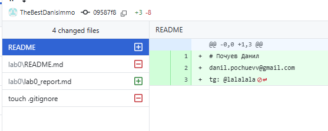
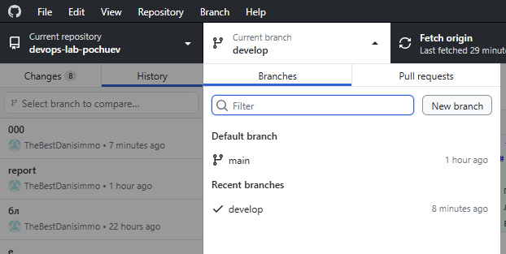
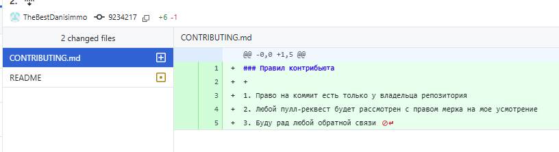

University: ITMO University  
Faculty: FTMI  
Course: Introduction in web tech  
Year: 2025  
Group: U4225  
Author: Pochuev Danil Valerevich  
Lab: Lab0  
Date of create: 29.09.2025  
Date of finished: 06.10.2025

### Ход работы  
1. Создание аккаунта и настройка SSH
2. Зарегистрирован аккаунт на GitHub  
3. Создан репозиторий
4. В веб-интерфейсе GitHub создан новый репозиторий с названием devops-lab-pochuev.
5. Клонирован репозитория на локальную машину 
6. Создан Файл README.md  

7. Добавлен .gitignore с типовыми исключениями для ОС (Windows/Linux).
8. Создана новая ветка develop  

9. Создан файл с правилами участия в проекте  

