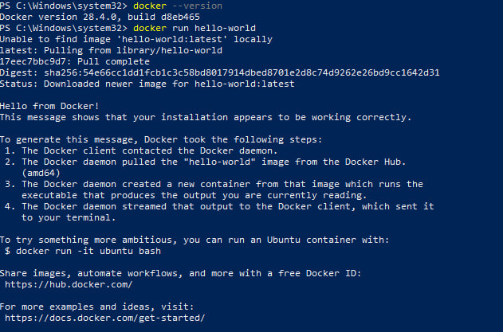
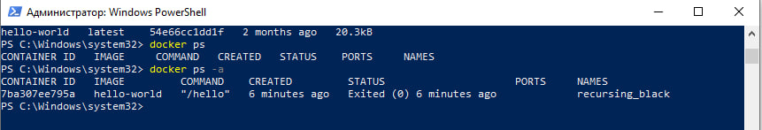
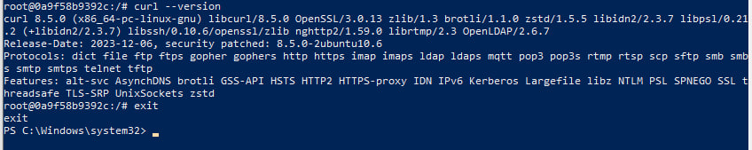
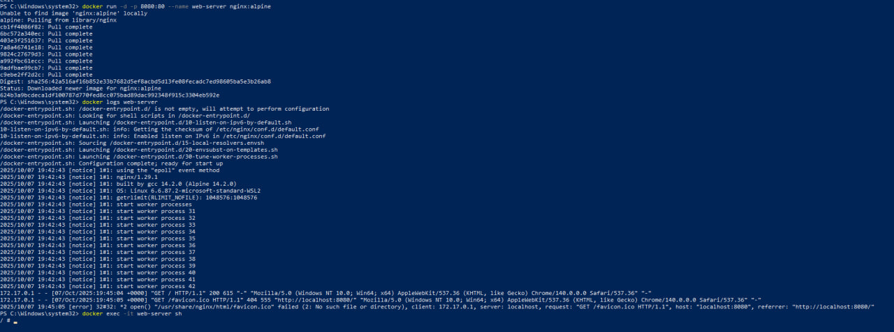
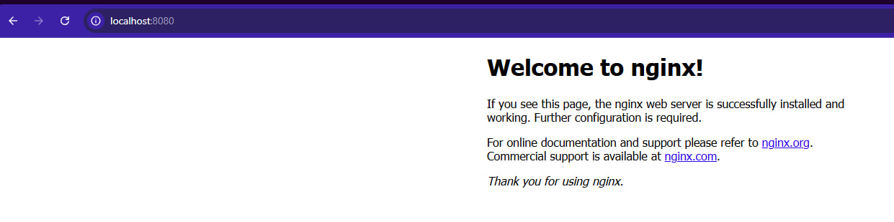
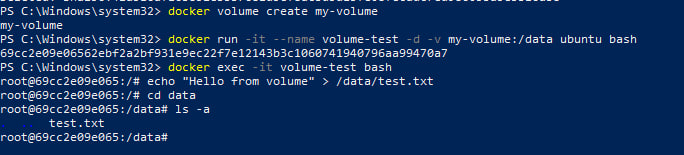

University: [ITMO University](https://itmo.ru/ru/)  
Faculty: [FICT](https://fict.itmo.ru)  
Course: [Введение в веб технологии](https://itmo-ict-faculty.github.io/introduction-in-web-tech/)  
Year: 2025/2026  
Group: U4225  
Author: Pochuev Danil Valerevich  
Lab: Lab1  
Date of create: 07.10.2025  
Date of finished: 07.10.2025

# Лабораторная работа: Изучение основ Docker

## Ход работы

### 1. Изучение основ Docker

#### Установка Docker

Первым шагом была установка Docker Desktop и проверка корректности установки. После успешной инсталляции необходимо было убедиться, что Docker работает корректно с помощью базовых команд.

**Выполненные действия:**
- Установлен Docker Desktop
- Проверена версия Docker: `docker --version`
- Запущен тестовый контейнер hello-world для проверки работы
- Изучены базовые команды для работы с образами и контейнерами

![Установка Docker]

### 2. Работа с готовыми образами

На этом этапе мы познакомились с работой с образами из Docker Hub - публичного реестра контейнеров. Мы скачали образ Ubuntu и поработали с интерактивным контейнером.

**Выполненные действия:**
- Скачан образ Ubuntu: `docker pull ubuntu:latest`
- Запущен интерактивный контейнер с доступом к bash
- Внутри контейнера установлен пакет curl для демонстрации работы с пакетным менеджером
- Проверена корректность установки пакета

![Работа с образами]](image-2.png)

### 3. Запуск веб-сервера

Здесь мы перешли к практическому применению Docker - запуску веб-сервера nginx в контейнере. Это демонстрирует мощь контейнеризации для развертывания приложений.

**Выполненные действия:**
- Запущен контейнер с nginx в фоновом режиме
- Настроен проброс портов для доступа к веб-серверу
- Проверена работа сервера через браузер
- Изучены логи контейнера для мониторинга работы
- Выполнено подключение к запущенному контейнеру

![Веб-сервер nginx]

### 4. Управление контейнерами

Этот этап посвящен управлению жизненным циклом контейнеров. Мы изучили основные операции: мониторинг, остановку, запуск и удаление контейнеров.

**Выполненные действия:**
- Просмотр запущенных и всех контейнеров
- Остановка и повторный запуск контейнера
- Удаление контейнеров и образов
- Освобождение дискового пространства

![Управление контейнерами]

### 5. Работа с томами (volumes)

Финальный этап посвящен работе с томами - механизму сохранения данных в Docker. Тома позволяют сохранять данные независимо от жизненного цикла контейнеров.

**Выполненные действия:**
- Создан том для хранения данных
- Запущен контейнер с подключенным томом
- Создан тестовый файл в томе
- Продемонстрирована персистентность данных после пересоздания контейнера

![Работа с томами]

