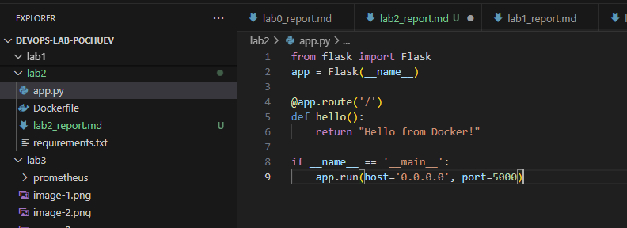
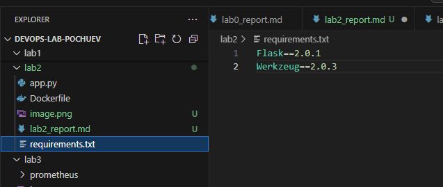
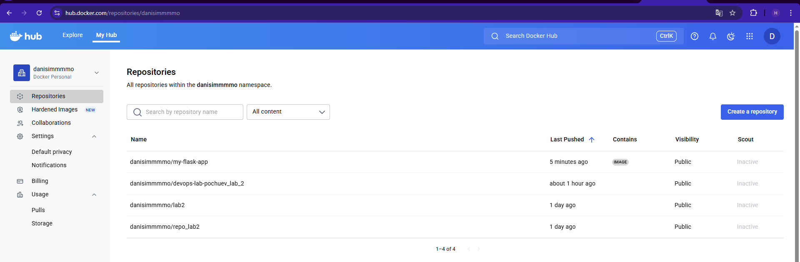
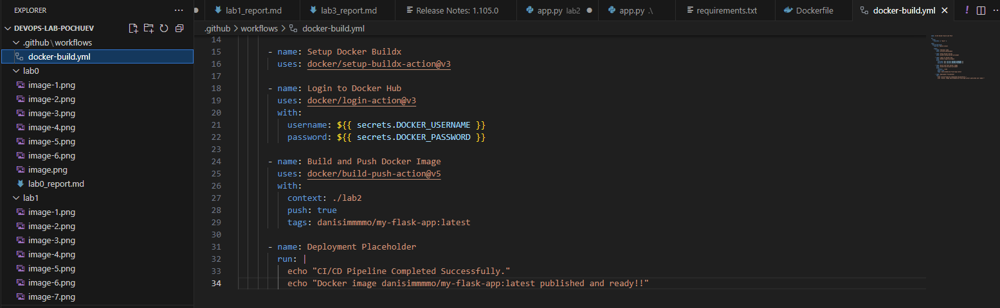
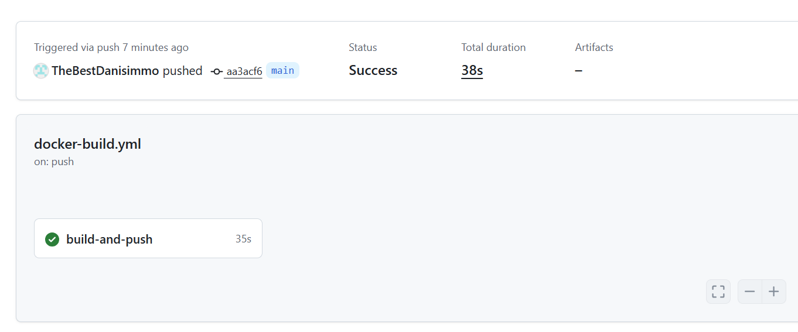
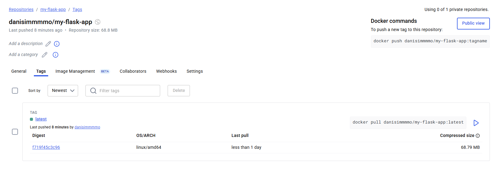

University: [ITMO University](https://itmo.ru/ru/)  
Faculty: [FICT](https://fict.itmo.ru)  
Course: [Введение в веб технологии](https://itmo-ict-faculty.github.io/introduction-in-web-tech/)  
Year: 2025/2026  
Group: U4225  
Author: Pochuev Danil Valerevich  
Lab: Lab2  
Date of create: 07.10.2025  
Date of finished: 13.10.2025

# Лабораторная работа: Настройка CI/CD пайплайна с GitHub Actions

## Цель работы
Освоить принципы настройки непрерывной интеграции и доставки (CI/CD) с использованием GitHub Actions, научиться автоматизировать процесс сборки и публикации Docker образов.

## Ход работы

### 1. Подготовка проекта

На этом этапе была подготовлена инфраструктура для работы пайплайна, включая создание репозиториев и подготовку файлов проекта.

**Выполненные действия:**
- Создан новый репозиторий на GitHub для проекта CI/CD
- Скопированы файлы из предыдущей лабораторной работы:
  - `app.py` - Flask приложение
  - `requirements.txt` - зависимости Python
  - `Dockerfile` - инструкции для сборки образа
- Создан аккаунт на Docker Hub (если отсутствовал)
- Создан новый репозиторий на Docker Hub для хранения образов

### 2. Настройка GitHub Actions

Был создан пайплайн автоматической сборки, который активируется при каждом обновлении кода в основной ветке.

**Выполненные действия:**
- Создана папка `.github/workflows/` для хранения workflow файлов
- Создан файл `docker-build.yml` с конфигурацией пайплайна
- Настроены триггеры запуска (push в main ветку)
- Определены шаги пайплайна:
  - Checkout кода
  - Настройка Docker Buildx
  - Аутентификация в Docker Hub
  - Сборка и публикация образа
  - Шаг деплоя (заглушка)

### 3. Настройка секретов

Для безопасной работы с внешними сервисами были настроены секретные переменные в репозитории.

**Выполненные действия:**
- В настройках GitHub репозитория добавлены секреты:
  - `DOCKER_USERNAME` - логин в Docker Hub
  - `DOCKER_PASSWORD` - токен доступа Docker Hub
- Проверена корректность настроек доступа

### 4. Тестирование пайплайна

Проведено тестирование работы всего CI/CD пайплайна от коммита до публикации образа.

**Выполненные действия:**
- Выполнен коммит и пуш изменений в main ветку
- Проверено выполнение пайплайна в разделе Actions GitHub
- Убедились, что образ успешно появился в репозитории Docker Hub
- Проанализированы логи выполнения каждого шага пайплайна
- Проверена корректность тегов и метаданных образа

## Пример содержимого файлов
