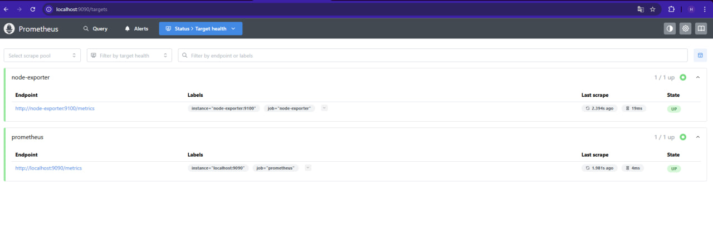
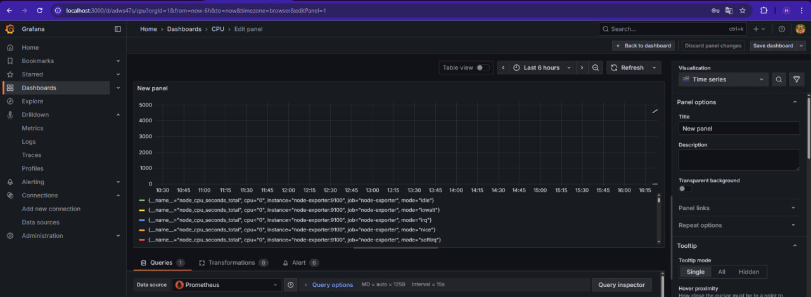

University: [ITMO University](https://itmo.ru/ru/)  
Faculty: [FICT](https://fict.itmo.ru)  
Course: [Введение в веб технологии](https://itmo-ict-faculty.github.io/introduction-in-web-tech/)  
Year: 2025/2026  
Group: U4225  
Author: Pochuev Danil Valerevich  
Lab: Lab3
Date of create: 12.10.2025  
Date of finished: 12.10.2025

# Лабораторная работа: Настройка мониторинга с Prometheus и Grafana

## Цель работы
Освоить принципы настройки системы мониторинга на основе стека Prometheus + Grafana, научиться собирать системные метрики с помощью Node Exporter и визуализировать их в дашбордах.

## Ход работы

### 1. Создание конфигурации Prometheus

Первым шагом была подготовка конфигурационного файла для Prometheus, который определяет источники метрик и параметры сбора данных.

**Выполненные действия:**
- Создана папка `prometheus` для хранения конфигурации
- Создан файл `prometheus.yml` с настройками двух job-ов:
  - `prometheus` - для самомониторинга самого Prometheus
  - `node-exporter` - для сбора системных метрик

### 2. Запуск Node Exporter

Node Exporter был запущен как контейнер Docker для сбора системных метрик хостовой машины.

**Выполненные действия:**
- Запущен контейнер Node Exporter с пробросом порта 9100
- Настроены volume-ы для доступа к системным директориям
- Проверена работа сервиса через запрос метрик

### 3. Запуск Prometheus

Prometheus был развернут как основной компонент системы мониторинга, отвечающий за сбор и хранение метрик.

**Выполненные действия:**
- Создан том `prometheus-data` для постоянного хранения данных
- Запущен контейнер Prometheus с подключением конфигурации и тома данных
- Настроены параметры хранения и жизненного цикла данных
- Проверена работа веб-интерфейса Prometheus

### 4. Запуск Grafana

Grafana была установлена как инструмент для визуализации собранных метрик.

**Выполненные действия:**
- Создан том `grafana-data` для хранения настроек и дашбордов
- Запущен контейнер Grafana с предустановленным паролем администратора
- Проверен доступ к веб-интерфейсу Grafana

### 5. Настройка Grafana

Произведена интеграция Grafana с Prometheus и создан первый дашборд для визуализации метрик.

**Выполненные действия:**
- Добавлен источник данных Prometheus с указанием корректного URL
- Проверено подключение к источнику данных
- Создан новый дашборд с графиком загрузки CPU
- Настроена визуализация метрики `node_cpu_seconds_total`

### 6. Тестирование системы

Проведено комплексное тестирование работы всей системы мониторинга.

**Выполненные действия:**
- Проверена работа всех контейнеров через `docker ps`
- Убедились в корректном сборе метрик в Prometheus
- Проверили отображение данных в Grafana
- Создали дополнительные графики для мониторинга памяти, диска и других метрик

